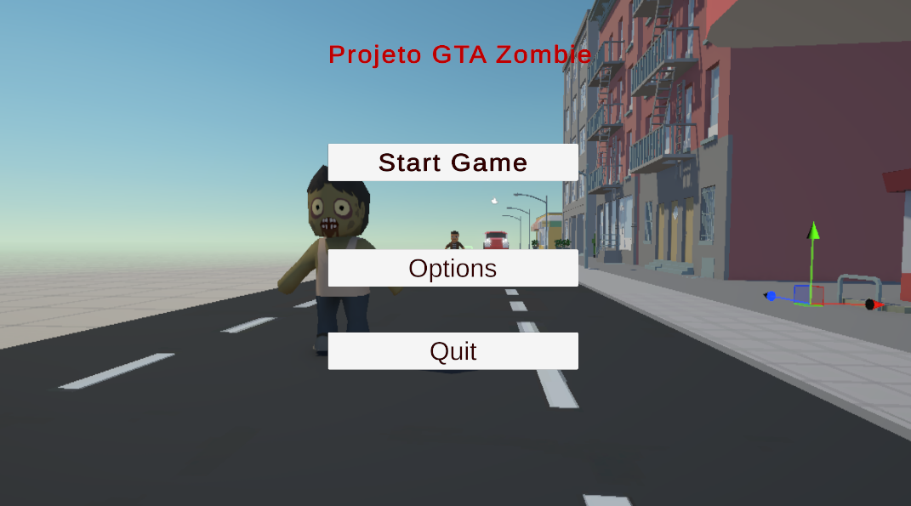
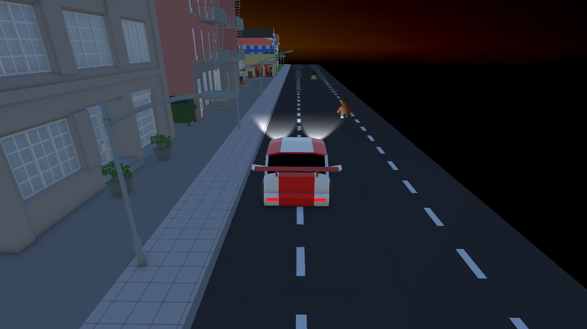
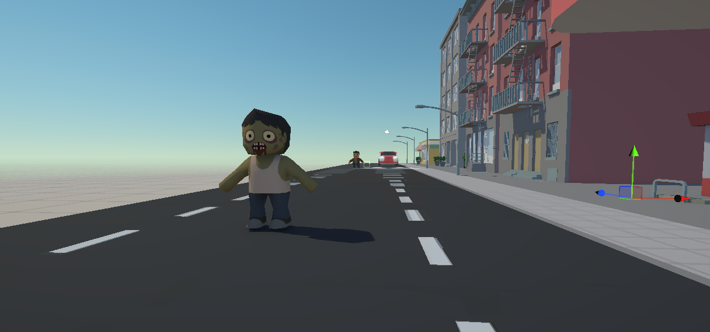

# Projeto GTA Zombie

## Descrição do Jogo

GTA Zombie é um jogo desenvolvido na Unity 3D onde o jogador explora uma cidade durante um apocalipse zumbi.

O projeto reúne diversos conceitos de Computação Gráfica e Desenvolvimento de Jogos, incluindo movimentação de veículos, controle de personagem em terceira pessoa, animações, inteligência artificial de perseguição, sistema de iluminação, alternância entre dia e noite, menu principal com música e interação com objetos do cenário.

O objetivo do jogador é sobreviver aos zumbis espalhados pela cidade, utilizando veículos e armas disponíveis pelo mapa.

---

# Instruções de Jogabilidade

## Controles do Carro

| Tecla  | Função                |
| ------ | --------------------- |
| W      | Acelerar              |
| S      | Ré                    |
| A      | Virar à esquerda      |
| D      | Virar à direita       |
| Espaço | Frear                 |
| Q      | Alternar Dia/Noite    |
| E      | Ligar/Desligar Faróis |
| 1      | Câmera 3ª Pessoa      |
| 2      | Câmera Interna        |
| 3      | Câmera da Roda        |

## Controles do Personagem

| Tecla  | Função              |
| ------ | ------------------- |
| W      | Andar para frente   |
| S      | Andar para trás     |
| A      | Girar para esquerda |
| D      | Girar para direita  |
| Espaço | Atacar com arma     |

---

# Vídeo de Gameplay

Substitua pelo link do vídeo:

https://youtu.be/SEU_VIDEO

---

# Prints do Jogo

## Menu Principal



---

# Funcionalidades Implementadas

## 1. Sistema de Dia e Noite

Foi desenvolvido um sistema capaz de alternar entre dia e noite durante a execução do jogo.

Quando o jogador pressiona a tecla **Q**, a iluminação global da cena é modificada, alterando a atmosfera do ambiente e aumentando a imersão.

### Trecho de Código

```csharp
void Update()
{
    if(Input.GetKeyDown(KeyCode.Q))
    {
        noite = !noite;

        if(noite)
        {
            directionalLight.intensity = 0.2f;
        }
        else
        {
            directionalLight.intensity = 1.0f;
        }
    }
}
```

### Demonstração



---

## 2. Inteligência Artificial dos Zumbis

Foi implementado um sistema de perseguição onde os zumbis detectam o personagem e passam a persegui-lo automaticamente.

O comportamento utiliza colisão, cálculo de distância e movimentação em direção ao alvo.

### Trecho de Código

```csharp
private void OnCollisionStay(Collision collision)
{
    if (collision.gameObject.tag == "Personagem")
    {
        zombieAnim.SetBool("runZombie", true);

        target = collision.gameObject.transform;

        float dist = Vector3.Distance(
            target.position,
            transform.position);

        if (dist <= _range)
        {
            transform.position =
                Vector3.MoveTowards(
                    transform.position,
                    target.position,
                    speed);
        }
    }
}
```

### Demonstração



---

## 3. Sistema de Faróis do Veículo

Foi criado um sistema que permite ligar e desligar os faróis do carro durante a partida.

A funcionalidade melhora a visibilidade durante o período noturno e aumenta a sensação de realismo.

### Trecho de Código

```csharp
void Update()
{
    if(Input.GetKeyDown(KeyCode.E))
    {
        ligado = !ligado;

        farolEsquerdo.enabled = ligado;
        farolDireito.enabled = ligado;
    }
}
```

### Demonstração


---

# Tecnologias Utilizadas

* Unity 3D
* C#
* Animator Controller
* Rigidbody
* Collider
* Sistema de Iluminação da Unity
* Sistema de Câmeras
* Assets Low Poly City
* Assets Toony Tiny People


